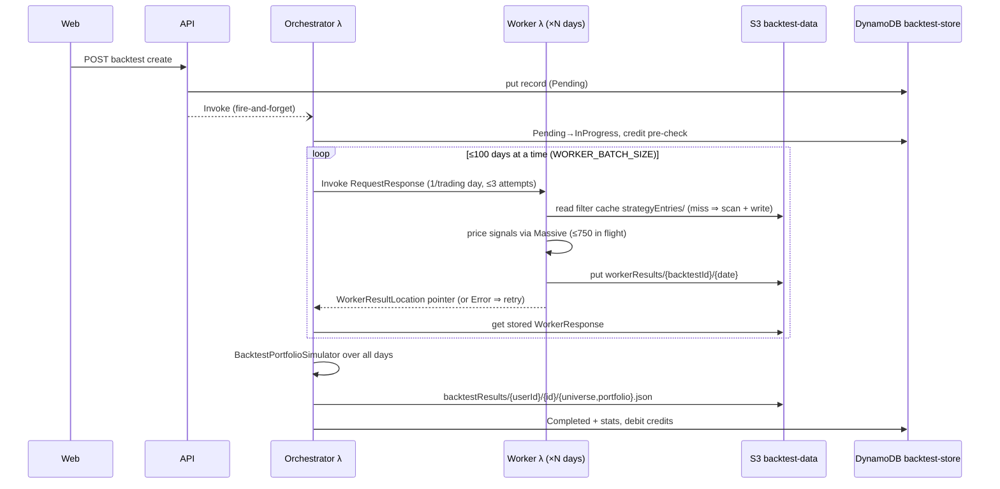

# StockMountain system map

The one-read orientation document: what the system is, what runs where, and how the three
core flows move data. Everything here describes the **present** state of the code (verified
2026-09-01); intended futures live in [plans/](../plans/README.md), settled rationale in
[docs/adr/](adr/). Every claim carries an anchor — when a row and the code disagree, the
code is right and this file has a bug: fix it in the same PR.

## What the system is

StockMountain lets a user author a stock-trading strategy as a set of filter expressions
(a small DSL), **backtest** it against historical minute data, **scan** live markets with
it, and **paper/auto-trade** it. Compute is metered as credits and billed via Stripe.

## Component inventory

| Component | Runs on | Entry point | Config source |
|---|---|---|---|
| Web SPA | Railway (`apps/web`) | `apps/web/src/routes/index.tsx` | Vite env |
| API (`MarketViewer.Api`) | Railway | `apps/api/MarketViewer.Api` controllers: Auth, Billing, Data, Management, Market, Tools | `appsettings.{env}.json` + env vars |
| Backtest orchestrator | Lambda `…-backtest-orchestrator` (1024MB) | `apps/backtester/Backtest.Lambda/OrchestratorFunction.cs` | `apps/backtester/Backtest.Lambda/appsettings.json` (`BacktestConfig`) |
| Backtest worker | Lambda `…-backtest-worker` (3008MB) | `apps/backtester/Backtest.Lambda/WorkerFunction.cs` | same image/appsettings as orchestrator |
| Market-data orchestrator | Lambda `…-market-data-orchestrator` (4096MB) | `apps/market-data-aggregator` | tf env vars |
| Market-data aggregator | Lambda `…-market-data-aggregator` (4096MB) | `apps/market-data-aggregator` | tf env vars |
| Billing refill | Lambda `…-billing-refill` (512MB) | `apps/billing` | tf env vars |
| Optimus (paper/auto trading) | Railway | `apps/paper-bot-runner/Optimus` | Railway env |

Shared libraries live in `packages/` (`marketviewer-contracts` is the type spine — requests,
responses, records; `marketviewer-filters` is the DSL engine; `massive-client` wraps the
Massive market-data API and **never throws** — failures come back as status-coded responses).

Infrastructure is `infra/tf/app/` (one stack: lambdas, DynamoDB, S3, SQS, IAM, Grafana
dashboards, Railway IAM). Deploy is `.github/workflows/app-deploy.yml`: every push touching
`apps/**`, `packages/**`, `tests/**`, or `infra/tf/app/**` builds all docker images and, on
the default branch, terraform-applies. Both backtest lambdas ship in **one image**
(`apps/backtester/Dockerfile`) differing only in the `image_config.command` handler string
(`infra/tf/app/lambda.tf`), so their contracts version together — but a run in flight across
a deploy boundary can straddle two versions (see ADR 0005 consequences).

## Flow 1: a backtest, end to end

Load-bearing details, in code:

- The worker **returns a pointer, not results** — full responses exceed Lambda's 6MB
  synchronous response cap and crash the runtime. ADR 0005; `WorkerResultStore.cs`.
- Per-layer retry budgets and error propagation: [registry.md § Errors](registry.md#error-propagation--retry-budgets).
- The worker handler **never leaks an exception**: `RunDay` throws become retryable
  pointer errors; everything below (Massive client, S3 cache) is caught locally. If you
  see an unhandled worker exception, it is in the runtime layer, not handler code —
  see [runbook.md](runbook.md).
- Signal→trade semantics (execution minute, intrabar exits, re-entry gating) are ADRs
  0003/0004 territory; the simulator (`packages/marketviewer-core`) re-applies position
  rules portfolio-wide, so the worker prices *candidates* and the simulator decides fills.

## Flow 2: market data supply

Nightly (EventBridge) or on backfill request, the market-data orchestrator expands a date
range into per-day/timeframe work items and fans out to the aggregator, which pulls from
Massive and writes bulk objects to the market-data bucket under the contract-v1 keys
(ADR 0001), cataloged in DynamoDB `market_data`. The backtest worker's `DataCache` loads
these bulk objects per date (~185MB JSON each in memory — hence the cache compaction in
`WorkerFunction`'s finally block).

## Flow 3: live scan and trading

The API's Market controllers run the same filter engine against live data; Optimus consumes
strategies for paper/auto trading (plan 08, phased; Alpaca adapter in
`packages/alpaca-client`). Live/backtest parity is the point: both sides share
`marketviewer-filters` and the execution conventions in ADRs 0003/0004 — a change to filter
semantics must bump `ScannerService.CacheVersion` and re-bless the golden tests
(`tests/marketviewer-filters-unit-tests/…/Golden/`).

## The tower of abstractions

| Level | Where it lives | What belongs there |
|---|---|---|
| Entry protocol | [/AGENTS.md](../AGENTS.md) | reading order, verification contract, docs-sync duties |
| System map | this file | topology, flows, process-level invariants |
| Registries | [registry.md](registry.md) | limits, budgets, storage keys, env vars, error taxonomy, credits |
| Operations | [observability.md](observability.md), [runbook.md](runbook.md) | signals reference, symptom→mechanism→query |
| Decisions | [adr/](adr/) | settled arguments with mechanism (append-only) |
| Intentions | [plans/](../plans/README.md) | self-contained hand-off units, with lifecycle status |
| Component contracts | `packages/marketviewer-contracts`, key builders (`MarketDataStorageContract`, `WorkerResultStore.BuildKey`, `ScannerService.BuildCacheKey`) | types and keys both sides compile against |
| Code | everywhere | comments state constraints the code can't show, nothing else |

Facts live at exactly one level and are linked from the others. Duplicating a fact here
that the registry owns (or vice versa) is a defect, not thoroughness.

## Known wrinkles (true today, candidates for fixing)

- API→orchestrator invoke is fire-and-forget with a discarded task
  (`BacktestHandler.Create`: `_ = lambda.InvokeAsync(...)`); the code comment says
  "Change this to SQS eventually". A dropped invoke leaves a record stuck `Pending`.
- SQS queues `backtest_orchestrator`, `backtest_filter`, `strategy_signals(+dlq)` are
  declared in `infra/tf/app/sqs.tf` with IAM grants, but no C# references them —
  provisioned ahead of the SQS migration above and plan 08.
- `workerResults/` has no lifecycle expiration yet (deliberate deferral; see ADR 0005
  consequences). The `shares/` prefix shows the pattern to copy in `s3.tf`.
