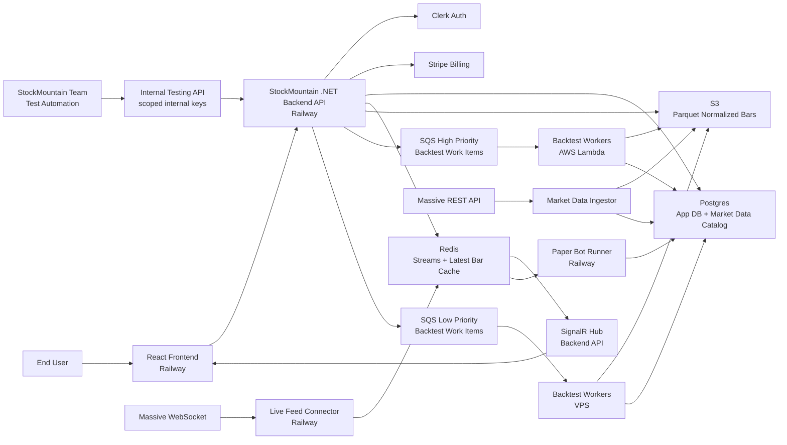

# StockMountain V1 Architecture

StockMountain V1 is a React and .NET application for building declarative stock trading Strategies, running asynchronous Backtest Runs, viewing normalized market data, and running Paper Bots. V1 supports US equities and ETFs, long-only simulated trading, bar-based Strategy evaluation, and individual User Accounts.

## Runtime Topology



## Services

**React Frontend**

The primary user interface. End users create Strategy Drafts, publish Strategy Versions, submit Backtest Runs, manage Watchlists, view charts, manage Paper Bots, see in-app Notifications, and manage Membership/Credits.

**StockMountain Backend API**

A modular .NET API hosted on Railway. It owns user-facing application contracts for auth integration, Strategies, Watchlists, market data reads, Backtest Run submission/status/results, Paper Bot management, charts, Notifications, Membership, Credits, and billing state.

The backend is not an external developer platform in V1. Internal testing endpoints may exist in production behind scoped internal keys, audit logging, and rate limits.

**Market Data Ingestor**

Imports historical market data from Massive, normalizes it into Split-Adjusted Bars, writes Parquet files to S3, and updates the Postgres market data catalog. It supports Scheduled Ingestion and Backfill.

**Live Feed Connector**

Owns the single Massive WebSocket connection. It publishes live Normalized Bars to Redis Streams and updates latest-bar cache entries. Raw provider events stay inside this service boundary in V1.

**Paper Bot Runner**

Runs Paper Bots on Railway. It consumes live Normalized Bars from Redis Streams, uses the shared Strategy evaluation library, maintains each Paper Bot Portfolio, persists Signals, Rejected Signals, Trades, Portfolio state, and performance history.

**Backtest Workers**

Consume Backtest Work Items from SQS. High-priority work is intended for AWS Lambda. Low-priority work is intended for the paid VPS. Both runtimes use the same work-item contract and shared Strategy evaluation library.

**Shared Strategy Library**

A .NET library used by Backtest Workers and the Paper Bot Runner. It validates and evaluates structured Strategy models, Filter Groups, Strategy Filters, Exit Rules, Position Sizing Rules, and Strategy execution semantics.

## Repository Structure

StockMountain V1 uses a monorepo with separate deployable applications and shared packages.

```text
stockmountain/
  apps/
    web/                         # React frontend
    api/                         # .NET Backend API
    live-feed-connector/         # .NET worker/service
    paper-bot-runner/            # .NET worker/service
    market-data-ingestor/        # .NET worker/service
    backtest-worker/             # .NET worker runnable for VPS/Lambda

  packages/
    strategy-engine/             # shared .NET Strategy evaluation library
    domain/                      # shared domain models/value objects
    market-data/                 # Normalized Bars, catalog contracts, parquet helpers
    backtesting/                 # Backtest planning/execution primitives
    billing/                     # Credit ledger primitives, usage policy
    contracts/                   # API/event/queue DTOs

  infra/
    railway/
    aws/
    scripts/

  docs/
    adr/
    v1-architecture.md

  tests/
    strategy-engine-tests/
    backtesting-tests/
    integration-tests/
```

## Core Data Stores

**Postgres**

Stores User Accounts, Strategies, Strategy Drafts, Strategy Versions, Strategy Snapshots, Watchlists, Universe Snapshots, Backtest Runs, Paper Bots, Signals, Rejected Signals, Trades, Notifications, Membership state, Credit Ledger entries, and market data catalog metadata.

**S3**

Stores durable historical Normalized Bars as Parquet files.

**Redis**

Stores live bar streams and latest-bar cache entries. Redis Streams are the internal distribution mechanism for live Normalized Bars.

**SQS**

Stores Backtest Work Items in high-priority and low-priority queues.

## Main Flows

**Backtest Run**

1. User submits a Backtest Run from a published Strategy Version.
2. Backend captures Strategy Snapshot and Universe Snapshot.
3. Backend checks active Membership and estimated Credit affordability.
4. Backend checks market data catalog.
5. Missing data triggers Backfill; Backfill does not consume user Credits.
6. When data is available, Backend reserves estimated Credits.
7. Backend plans symbol-partitioned Backtest Work Items.
8. Workers execute using the shared Strategy library and historical Parquet bars.
9. Results are merged through shared Portfolio semantics.
10. Backend persists summary metrics, Signals, Rejected Signals, Trades, and settles Credits.

**Paper Bot**

1. User creates or starts a Paper Bot from a published Strategy Version and Universe source.
2. Backend captures Strategy Snapshot and Universe Snapshot.
3. Paper Bot capacity is checked against active Membership.
4. Paper Bot Runner consumes live Normalized Bars from Redis Streams.
5. Runner evaluates Strategy logic with the shared Strategy library.
6. Runner persists Signals, Rejected Signals, Trades, Portfolio state, and performance history.
7. Paper Bot Notifications are created according to Notification Preferences.

**Charting**

1. Frontend requests Chart Data from the Backend API.
2. Backend serves historical chart data from stored Normalized Bars.
3. Missing historical data triggers Backfill.
4. Live chart updates flow from Live Feed Connector to Redis Streams to Backend SignalR to React.

## V1 Constraints

- US equities and ETFs only.
- Long Trades only.
- Paper Bots only; no real broker orders.
- Strategy evaluation is bar-based.
- Completed Bars are the default evaluation input.
- In-Progress Bars may be explicitly enabled by a Strategy.
- Regular market hours are the default Market Session Scope.
- Historical bars are split-adjusted and not dividend-adjusted.
- One open Trade per symbol per Portfolio.
- Backtest Runs are always asynchronous.
- Backtest Run execution consumes Credits.
- Backfill does not consume user Credits.
- Active Membership is required for Backtest Run execution and Paper Bots.
- Inactive Membership keeps prior data readable but pauses Paper Bots and prevents new execution.
